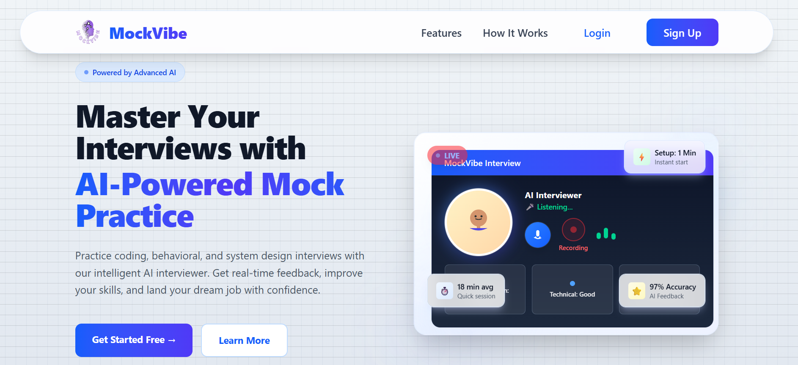
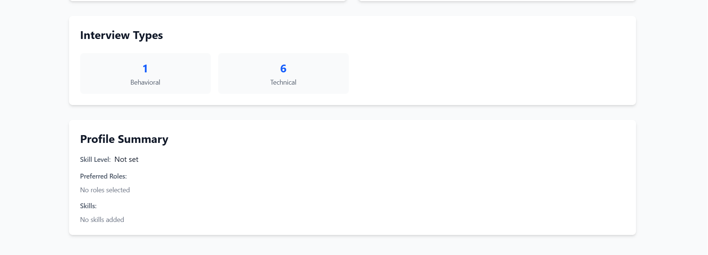
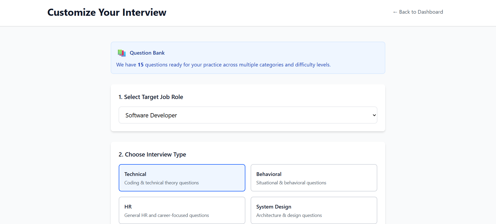

<div align="center">

# MockVibe - AI-Powered Interview & Practice Platform
Comprehensive Interview Preparation Platform with AI-Driven Mock Interviews, Video Analysis, and Voice Assessment.

[📖 Documentation](#-overview) | [🚀 Quick Start](#-installation) | [🎯 Features](#-features)

[](https://choosealicense.com/licenses/mit/)
[](https://nodejs.org/)
[](https://reactjs.org/)
[](https://vitejs.dev/)
[](https://www.mongodb.com/)
[](https://ai.google.dev/)
[](https://tailwindcss.com/)
</div>

## 📋 Table of Contents

- [Overview](#-overview)
- [Features](#-features)
- [Tech Stack](#%EF%B8%8F-tech-stack)
- [Project Structure](#-project-structure)
- [Installation](#-installation)
- [Usage](#-usage)
- [Contributing](#-contributing)
- [Author](#-author)
- [License](#-license)

## 🌟 Overview

**MockVibe** is a cutting-edge interview preparation platform that combines AI-powered mock interviews, advanced video analysis, and voice assessment to help candidates practice and master interview skills. Built with modern web technologies, it provides real-time feedback, personalized practice sessions, and comprehensive interview analytics.

### 🎯 Key Highlights

- **AI-Powered Mock Interviews** with Gemini AI integration
- **Real-Time Video Analysis** using TensorFlow.js (BlazeFace)
- **Voice Interview Assessment** with speech recognition and analysis
- **Advanced Video Interview Mode** with behavioral analysis
- **Question Bank Management** with difficulty levels
- **Interview History & Analytics** for performance tracking
- **Admin Dashboard** for content management
- **User Preference Management** for customized practice sessions
- **JWT-based Secure Authentication**

## ✨ Features

### 🔐 Authentication & User Management

- JWT-based secure authentication with bcryptjs encryption
- User registration and login with validation
- Profile customization (username, bio, preferences)
- Role-based access control (User/Admin)
- Secure session management
- User preference storage and retrieval

### 🎬 Interview Modes

#### AI Interview
- **Gemini AI Integration**: Chat with AI for mock interviews
- **Real-time Responses**: AI generates contextual interview questions
- **Conversational Practice**: Natural language interaction
- **Question Suggestions**: AI recommends relevant questions
- **Response Analysis**: AI evaluates your answers

#### Video Interview
- **Webcam Recording**: Capture your video responses
- **Real-time Preview**: See yourself during practice
- **Video Playback**: Review recorded interviews
- **Facial Expression Analysis**: TensorFlow.js BlazeFace integration
- **Performance Metrics**: Detect facial landmarks and emotional cues

#### Advanced Video Interview
- **Enhanced Video Analysis**: Advanced facial recognition
- **Behavioral Assessment**: Eye contact, head movement detection
- **Confidence Scoring**: Real-time confidence metrics
- **Video Quality Control**: Optimize video settings
- **Detailed Analytics**: Comprehensive performance reports

#### Voice Interview
- **Speech Recognition**: Real-time transcription
- **Voice Analysis**: Tone, pace, and clarity assessment
- **Audio Playback**: Review your voice responses
- **Pronunciation Evaluation**: Speech quality metrics
- **Communication Skills**: Assess speaking proficiency

### 📝 Question Management

- **Diverse Question Bank**: Multiple interview topics and difficulty levels
- **Category-Based Questions**: Organize questions by domain
- **Difficulty Levels**: Easy, Medium, Hard questions
- **Custom Questions**: Add personalized practice questions
- **Question Seeding**: Pre-populated database for quick start

### 📊 Interview Analytics & History

- **Call History**: Track all past interviews
- **Performance Statistics**: Analyze your improvement over time
- **Detailed Reports**: Comprehensive interview analytics
- **Attempt Tracking**: Monitor practice frequency
- **Progress Metrics**: Visual representation of your growth

### ⚙️ Admin Panel

- **User Management**: Monitor and manage registered users
- **Question Management**: Add, edit, delete interview questions
- **Admin Tools**: Make users admin with admin tools
- **Content Control**: Full control over question bank
- **Platform Analytics**: Monitor platform usage and metrics

### 🔔 Notifications

- **Interview Alerts**: Notifications for session events
- **Real-time Updates**: Live notification system
- **Event Tracking**: Track important platform events
- **User Notifications**: Personalized user alerts

## ⚙️ Tech Stack

### Frontend

```
Framework: React 19.x 🛠️
Build Tool: Vite ⚙️
Styling: Tailwind CSS v4 🎨
Routing: React Router DOM 🗺️
HTTP Client: Axios 🌐
Icons: Lucide React 🌟
Form Handling: React Hook Form (optional) 📋
```

### Backend

```
Runtime: Node.js 18+ 🟢
Framework: Express.js 5.x 🚀
Database: MongoDB + Mongoose 🗄️
Authentication: JWT (jsonwebtoken) 🔑
AI Integration: Google Generative AI (Gemini) 🤖
Validation: Express Validator 🔍
Security: Bcryptjs, CORS 🔒
```

### DevOps & Deployment

```
Frontend: Vercel 🌐
Backend: Render 🚀
Database: MongoDB Atlas 🗄️
Version Control: Git + GitHub 🧑‍💻
```

## 📁 Project Structure

```
MockVibe/
├── backend/
│   ├── config/
│   │   └── db.js                          # MongoDB connection
│   ├── controllers/
│   │   ├── authController.js              # Authentication logic
│   │   ├── userController.js              # User management
│   │   ├── aiInterviewController.js       # AI interview handling
│   │   ├── advancedVideoController.js     # Advanced video analysis
│   │   ├── voiceInterviewController.js    # Voice interview processing
│   │   ├── interviewController.js         # Interview session management
│   │   ├── questionController.js          # Question CRUD operations
│   │   ├── adminController.js             # Admin operations
│   │   ├── adminQuestionController.js     # Admin question management
│   │   ├── statisticsController.js        # Analytics and statistics
│   │   ├── notificationController.js      # Notification handling
│   │   └── preferencesController.js       # User preferences
│   ├── middleware/
│   │   └── authMiddleware.js              # JWT verification
│   ├── models/
│   │   ├── User.js                        # User schema
│   │   ├── InterviewSession.js            # Interview session schema
│   │   ├── Question.js                    # Question schema
│   │   ├── Notification.js                # Notification schema
│   │   └── UserPreference.js              # User preference schema
│   ├── routes/
│   │   ├── authRoutes.js                  # /api/auth/*
│   │   ├── userRoutes.js                  # /api/user/*
│   │   ├── aiInterviewRoutes.js           # /api/ai-interview/*
│   │   ├── advancedVideoRoutes.js         # /api/advanced-video/*
│   │   ├── voiceInterviewRoutes.js        # /api/voice-interview/*
│   │   ├── interviewRoutes.js             # /api/interview/*
│   │   ├── questionRoutes.js              # /api/questions/*
│   │   ├── adminRoutes.js                 # /api/admin/*
│   │   ├── statisticsRoutes.js            # /api/statistics/*
│   │   ├── notificationRoutes.js          # /api/notifications/*
│   │   └── preferencesRoutes.js           # /api/preferences/*
│   ├── services/
│   │   ├── aiService.js                   # Google Generative AI integration
│   │   ├── codeExecutionService.js        # Code execution with VM2
│   │   └── speechAnalysisService.js       # Voice analysis processing
│   ├── utils/
│   │   └── generateToken.js               # JWT token generation
│   ├── .env                               # Environment variables
│   ├── .env.example                       # Example environment file
│   ├── server.js                          # Entry point
│   ├── seedQuestions.js                   # Sample questions seeding
│   ├── seedQuestionsDatabase.js           # Database seeding script
│   ├── makeAdmin.js                       # Admin user creation script
│   └── package.json
│
├── frontend/
│   ├── public/                            # Static assets
│   ├── src/
│   │   ├── components/
│   │   │   ├── ProtectedRoute.jsx         # Protected route wrapper
│   │   │   ├── VideoInterview.jsx         # Video interview component
│   │   │   ├── AdvancedVideoInterview.jsx # Advanced video interview
│   │   │   └── VoiceInterview.jsx         # Voice interview component
│   │   ├── config/
│   │   │   └── api.js                     # Axios API configuration
│   │   ├── context/
│   │   │   └── AuthContext.jsx            # Authentication context
│   │   ├── pages/
│   │   │   ├── Landing.jsx                # Landing page
│   │   │   ├── Login.jsx                  # Login page
│   │   │   ├── Register.jsx               # Registration page
│   │   │   ├── ProfileSetup.jsx           # Profile setup page
│   │   │   ├── Dashboard.jsx              # Main dashboard
│   │   │   ├── InterviewCustomization.jsx # Interview settings
│   │   │   ├── InterviewSession.jsx       # Active interview session
│   │   │   ├── InterviewResult.jsx        # Interview results page
│   │   │   ├── InterviewHistory.jsx       # Past interviews history
│   │   │   ├── PracticeMode.jsx           # Practice mode selection
│   │   │   ├── Settings.jsx               # User settings page
│   │   │   └── admin/
│   │   │       ├── AdminDashboard.jsx     # Admin dashboard
│   │   │       ├── UserManagement.jsx     # Manage users
│   │   │       └── QuestionManagement.jsx # Manage questions
│   │   ├── App.jsx                        # Root component
│   │   ├── main.jsx                       # Entry point
│   │   └── index.css                      # Tailwind imports
│   ├── .env                               # Environment variables
│   ├── vite.config.js                     # Vite configuration
│   ├── eslint.config.js                   # ESLint configuration
│   ├── index.html                         # HTML template
│   └── package.json
│
├── .gitignore
├── README.md
└── LICENSE
```

## 🚀 Installation

### Prerequisites

- Node.js 18+ and npm/yarn
- MongoDB (Local or Atlas)
- Google Generative AI API Key
- Git & GitHub
- Modern web browser with WebRTC support

### 1. Clone Repository

```bash
git clone https://github.com/singharpitaa05/MockVibe.git
cd MockVibe
```

### 2. Backend Setup

```bash
cd backend
npm install
```

Create `.env` file in backend:

```env
# Server
NODE_ENV=development
PORT=5000

# Database
MONGODB_URI=

# Authentication
JWT_SECRET=

# Google Generative AI
GEMINI_API_KEY=

# CORS
CLIENT_URL=http://localhost:5173
```

**Get Google Generative AI API Key:**
1. Go to [Google AI Studio](https://aistudio.google.com/app/apikey)
2. Click "Create API Key"
3. Copy your API key and paste in `.env`

Start backend:

```bash
npm run dev
```

Backend runs on: `http://localhost:5000`

### 3. Seed Questions (Optional)

```bash
node seedQuestionsDatabase.js
```

### 4. Create Admin User (Optional)

```bash
node makeAdmin.js
```

### 5. Frontend Setup

```bash
cd frontend
npm install
```

Create `.env` file in frontend:

```env
VITE_API_URL=http://localhost:5000/api
VITE_SOCKET_URL=http://localhost:5000
```

Start frontend:

```bash
npm run dev
```

Frontend runs on: `http://localhost:5173`

### 6. Access Application

Open browser: `http://localhost:5173`

## 🎮 Usage

### For Users

1. **Sign Up**: Create a new account with email and password
2. **Profile Setup**: Complete your profile with basic information
3. **Choose Interview Mode**: Select from AI, Video, Advanced Video, or Voice interview
4. **Practice**: Start your mock interview session
5. **Review Results**: Check your performance analytics
6. **Track Progress**: Monitor your improvement over time

### For Admins

1. **Access Admin Dashboard**: Navigate to `/admin` (requires admin role)
2. **Manage Users**: View, update, or manage user accounts
3. **Manage Questions**: Add, edit, or delete interview questions
4. **View Statistics**: Monitor platform usage and user activity
5. **Make New Admins**: Promote users to admin status

### How to Contribute

1. Fork the repository
2. Create feature branch: `git checkout -b feature/amazing-feature`
3. Commit changes: `git commit -m "Add amazing feature"`
4. Push to branch: `git push origin feature/amazing-feature`
5. Open a Pull Request

## 👤 Author
## 📸 Screenshots

### Landing Page



### Dashboard & Analytics




### Interview Sessions



## 👤 Author

Designed and Developed with 💖 by **Arpita Singh**

🔗 **Connect with me:**

- 📧 [Email](mailto:singharpita.05march@gmail.com)
- 💼 [LinkedIn](https://www.linkedin.com/in/singharpitaa05/)
- 🐙 [GitHub](https://github.com/singharpitaa05)

📬 Feel free to reach out for questions, suggestions, or collaboration!

## 📄 License

This project is licensed under the **MIT License** - see the [LICENSE](LICENSE) file for details.